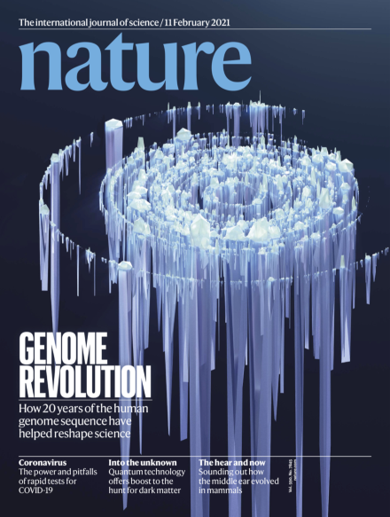
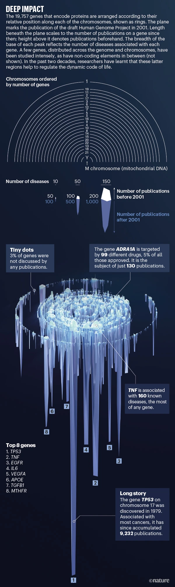

# Abstract

A new analysis traces the story of the draft genome's impact on genomics since 2001, linking its effects on publications, drug approvals and understanding of disease.

# Cover

## **Superstar genes**

The popular perception is that the HGP marked the start of the intensive search for protein-coding genes. In fact, the 2001 draft HGP paper signalled the end of a decades-long hunt[1](https://www.nature.com/articles/d41586-021-00314-6#ref-CR1),[2](https://www.nature.com/articles/d41586-021-00314-6#ref-CR2). Indeed, evidence for the first protein-coding gene emerged in 1902, with the discovery of the hormone secretin[4](https://www.nature.com/articles/d41586-021-00314-6#ref-CR4) (*SCT* gene), 50 years before the structure of DNA was uncovered, and 75 years before genome sequencing became commonplace. Our analysis shows that, between the start of the HGP in 1990 and its completion in 2003 (after the draft was published in 2001), the number of discovered (or \'annotated\') human genes grew drastically. It levelled out suddenly in the mid-2000s at about 20,000 protein-coding genes (see \'Twenty years of junk, stars and drugs: Non-coding elements\'), far short of the 100,000-strong estimate previously adopted by many in the scientific community[2](https://www.nature.com/articles/d41586-021-00314-6#ref-CR2).

# Citation

Gates, A. J., Gysi, D. M., Kellis, M., Barabási, A.-L. (2021). A wealth of discovery built on the Human Genome Project --- by the numbers. Nature 2021 590:7845, 590(7845), 212--215. <https://doi.org/10.1038/d41586-021-00314-6>
